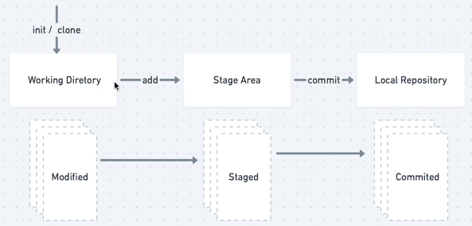

# GIT - Versionamento de Código
- Controle de versão distribuído
- Histórico de alterações no código, com os <i>commits</i>
- Controlar fluxo de novas funcionalidades, com ramificações chamadas </i>branch</i>
- ajuda: <code>git help [comando]</code>

## Comandos

- Iniciar um repositório: <code>git init</code>
  - Pasta .git é onde está toda a história do projeto

- Rastrear arquivos: <code>git add .</code>
  - Desrastrear um arquivo: <code>git rm --cached [nome-arquivo]</code>

- Enviar arquivo para a história: <code>git commit -m "descrição do commit"</code>

- <code>git diff</code>: ver as modificações nos arquivos que já estavam na linha do tempo
  - <code>git diff --staged</code>: mostra as diferenças entre os arquivos que estão comitados e os que estão apenas rastreados

- Restaurar mudanças no arquivo sem estar rastreado: <code>git restore [nome-arquivo]</code>
  - <code>git restore --staged [nome-arquivo]</code>: restaurar arquivos já rastreados OU <code>git restore HEAD [nome-arquivo]</code>

- Corrigir a mensagem de um commit ou adicionar/remover um novo arquivo a um commit ja feito: <code>git commit --amend -m "nova mensagem"</code>
  - No caso de adicionar/remover um novo arquivo: git add -> git commit -amend -m "Mensagem"

- Recuperar um arquivo: <code>git checkout [parteHashCommit] -- [nome-arquivo]</code>

- Reverter um commit: <code>git revert HEAD~5</code>
  - onde nossa HEAD estiver, a cada commit subtrairemos 1, então, considere o commit atual como 0, o abaixo desse -1, o abaixo desse -2 e por aí vai.

### Log do git: 
<code>git log</code>
-  Conseguimos saber o ponto da história
  - Todo nome do commit é uma hash, do tipo SHA-1
  - HEAD: sempre aponta a branch em que o ponto da história está
<code>git log --oneline</code>: trás as mesmas informações, porém de forma resumida
<code>git log -n 5</code>: trás as informações dos últimos 5 commits
<code>git log --since=aaaa-mm-dd</code>: commits feitos a partir da data indicada
<code>git log --until=aaaa-mm-dd</code>: commits feitos anteriores a data indicada
<code>git log --author=nomeAutor</code>: filtrar commits pelo autor
<code>git log --grep="init"</code>: usa expressões regulares para encontrar commits

## Conceitos

### Estágios do arquivo

### Git Workflow
Os arquivos são substituídos pelos mais recentes, porém ficam salvos em uma linha do tempo

### Hash SHA-1
- Nome dado à cada commit, que é dado através de uma hash chamada SHA-1
- Importante para manter a integridade dos dados
- Dentro dessa string existe uma snapshot, que mostra o autor, o pai e a mensagem do nosso commit

### HEAD
- No git, significa um ponteiro que aponta em que ponto da história estamos
